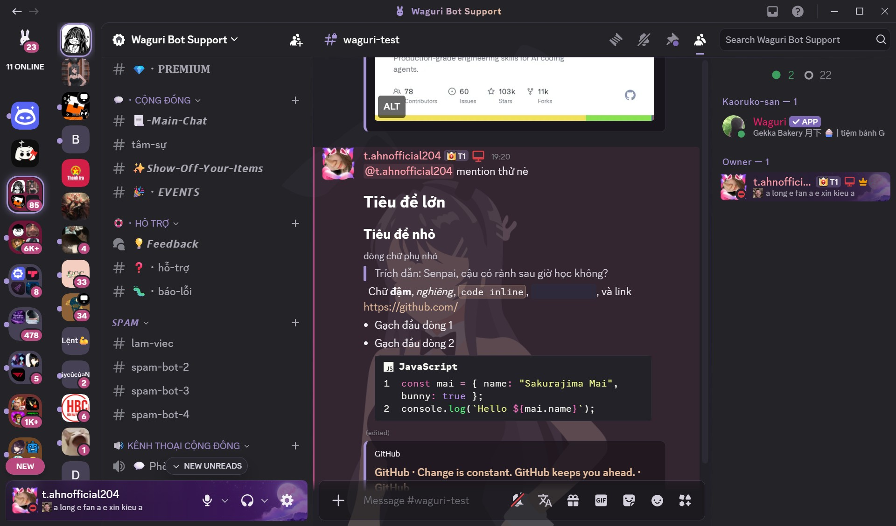
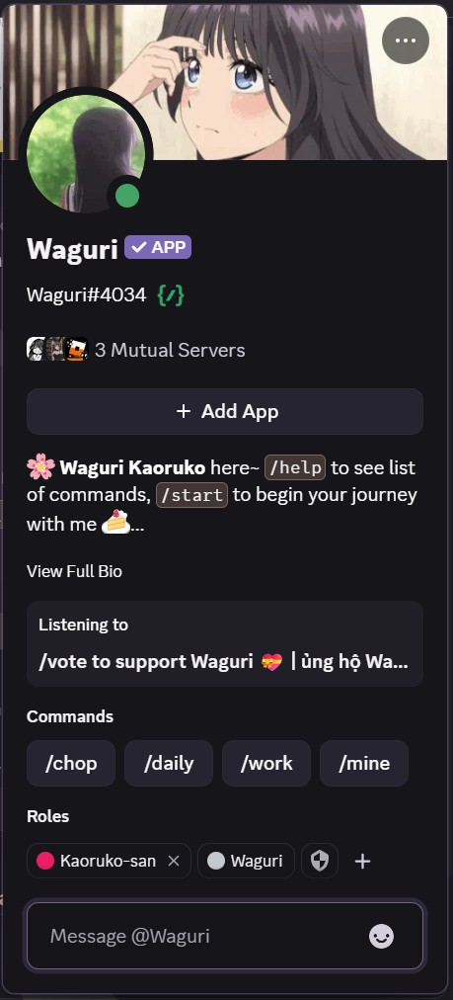
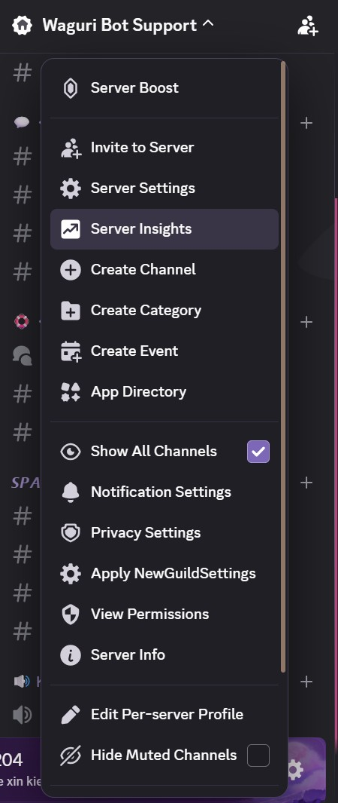

<p align="center">
  
</p>

<h1 align="center">Sakurajima Mai Theme</h1>

<p align="center">
  A calm, lavender Discord theme inspired by Sakurajima Mai (<i>Rascal Does Not Dream of Bunny Girl Senpai</i>),<br>
  built on top of <a href="https://github.com/puckzxz/NotAnotherAnimeTheme">NotAnotherAnimeTheme</a> by puckzxz.
</p>

<p align="center">
  
  
  
  
</p>

<p align="center">
  <b>English</b> · <a href="README.vi.md">Tiếng Việt</a>
</p>

---

## Features

- **Balanced glass style:** the wallpaper stays visible behind the sidebars and chat, while a dark glass layer keeps text readable. Popouts, menus, tooltips and modals are 100% solid, so they never blend into the background.
- **Lavender Dusk palette:** amethyst lavender and porcelain peach taken from the wallpaper, on dark surfaces stepped from the same hue. One block of variables recolors the whole theme.
- **Built on Discord's own design tokens:** menus, popouts, tooltips, modals, pickers and secondary screens (Discovery, Shop, Quests, Stage, Onboarding...) are themed through the variables Discord actually uses, so they survive most Discord updates.
- **Clear color meaning:** lavender means unread or selected, rose-mauve means a mention, red is kept for danger actions and muted microphones, green for "speaking" and "connected".
- **Small, calm interactions:** hover rails, a soft lift on servers, sliding link underlines, a gentle reaction pop. Nothing loops except the wallpaper.
- **Bunny signature:** a lavender bunny logo in the title bar, a gradient server name, a diamond notch on unread channels and the bunny hairpin home icon.
- **Plugin friendly:** BetterFolders, ShikiCodeblocks, RoleColorEverywhere and friends keep their own colors, with one-line switches if you prefer the Mai palette.
- **Accessible:** honors Discord's Reduced Motion, High Contrast and Saturation settings, Windows High Contrast, and the OS reduced-motion preference (still wallpaper). Key text and buttons meet WCAG AA contrast.

## Preview

| Profile popout | Menus |
|---|---|
|  |  |

## Installation

### Vencord / Vesktop

**Option A: online link (updates automatically)**

1. Open **User Settings → Vencord → Themes → Online Themes**.
2. Paste this link:
   ```
   https://raw.githubusercontent.com/takeisan24/Sakurajima-Mai-Discord-Theme/refs/heads/master/SakurajimaMai.theme.css
   ```

**Option B: local file**

1. Download [`SakurajimaMai.theme.css`](https://raw.githubusercontent.com/takeisan24/Sakurajima-Mai-Discord-Theme/refs/heads/master/SakurajimaMai.theme.css).
2. Open **User Settings → Vencord → Themes → Open Themes Folder** and put the file there.
3. Enable **Sakurajima Mai Theme** in the theme list.

### BetterDiscord

1. Download [`SakurajimaMai.theme.css`](https://raw.githubusercontent.com/takeisan24/Sakurajima-Mai-Discord-Theme/refs/heads/master/SakurajimaMai.theme.css).
2. Open **User Settings → Themes → Open Themes Folder** (usually `%AppData%\BetterDiscord\themes`) and put the file there.
3. Enable **Sakurajima Mai Theme**.

> BetterDiscord uses the same file, but the theme is developed and tested on Vencord. If something looks off on BetterDiscord, please [report it](#support).

> The theme always renders the dark Mai look, whichever Discord appearance you pick (Dark, Ash, Onyx, Light or a Nitro color theme), so nothing conflicts.

## Customization

Do **not** edit the theme file itself. It is replaced every time the theme updates. Put your overrides in **QuickCSS** instead (Vencord: *Themes → Edit QuickCSS*; BetterDiscord: *Custom CSS*). Your overrides then survive updates.

Copy the variables you want to change, for example:

```css
:root {
  /* Wallpaper. Bundled variants of the Mai GIF:
     maisan-soft.gif (default), maisan.gif (original, more vivid),
     maisan-silhouette.gif (dark silhouette, easiest reading).
     Or any .jpg / .png / .gif URL of your own. */
  --theme-background-image: url("https://raw.githubusercontent.com/takeisan24/Sakurajima-Mai-Discord-Theme/refs/heads/master/image/maisan.gif") !important;

  /* Glass over the whole app. Lower alpha = more wallpaper.
     More glass: 0.30   Default: 0.42   Easier reading: 0.60 */
  --theme-transparency: rgb(var(--sm-glass-rgb) / 0.42) !important;

  /* Extra glass on the chat only, where text sits over Mai.
     0.15 = default (soft wallpaper), 0.35 = recommended with the original wallpaper */
  --sm-chat-glass: 0.15 !important;

  /* Lavender separators around the chat (0 hides them) */
  --sm-separator-alpha: 0.6 !important;

  /* Blur behind the bottom-left user panel (0px disables it) */
  --sm-panel-blur: 10px !important;
}
```

### All variables

| Variable | Default | What it changes |
|---|---|---|
| `--theme-background-image` | `maisan-soft.gif` | Wallpaper. Also bundled: `maisan.gif` (original), `maisan-silhouette.gif` |
| `--sm-wallpaper-color` | `#302e34` | Color around the wallpaper and while it loads |
| `--sm-wallpaper-reduced-motion` | `maisan-soft-static.png` | Still image used when reduced motion is on. Set it to your own still image if you replace the wallpaper |
| `--sm-wallpaper-position`, `--sm-wallpaper-size` | `center`, `cover` | Wallpaper placement (e.g. `right bottom` / `auto 100%` for a cut-out character) |
| `--sm-glass-rgb` | `20 19 24` | Tint of every glass layer |
| `--theme-transparency` | `rgb(var(--sm-glass-rgb) / .42)` | Glass over the whole app |
| `--sm-chat-glass` | `0.15` | Extra glass on the chat and friends list (keeps text readable over Mai) |
| `--message-box-transparency` | `rgb(var(--sm-glass-rgb) / .48)` | Message box and user panel glass |
| `--sm-panel-blur` | `10px` | Blur behind the user panel |
| `--sm-separator-alpha` | `0.6` | Lavender separators around the chat (`0` hides them) |
| `--sm-accent` + `--sm-accent-rgb` | `#a895d6` / `168 149 214` | Main accent (hover, highlights, selection). **Change both together.** |
| `--sm-accent-strong` (+ `-hover`, `-active`) | `#7d68b8` | Filled buttons, switches, badges. Keep it dark enough for white text. |
| `--sm-accent-2` + `--sm-accent-2-rgb` | `#e8bf9f` / `232 191 159` | Secondary accent (links, scrollbar, inline code). **Change both together.** |
| `--sm-mention` + `--sm-mention-rgb` | `#b9487f` / `185 72 127` | Mentions: highlighted messages, mention badges, notification dots. **Change both together.** |
| `--sm-surface-0` … `--sm-surface-3` | `#16151a` … `#28262d` | Solid surfaces for popouts, menus, tooltips, modals |
| `--sm-text`, `--sm-text-strong`, `--sm-text-subtle`, `--sm-text-muted` | `#f4f2f6`, `#fff`, `#d3d0dc`, `#a9a6b2` | Text colors |
| `--sm-nitro-profiles` | `native` | `native` keeps other people's Nitro profile colors, `mai` redraws every profile in the Mai palette |
| `--sm-role-mentions` | `native` | `mai` repaints RoleColorEverywhere's role-colored @mentions in the Mai mention color |
| `--sm-codeblocks` | `native` | `mai` puts ShikiCodeblocks on the Mai surface (syntax colors stay) |
| `--sm-radius-menu` | `12px` | Context menu corners |
| `--sm-logo-mask` | Bunny head SVG | Title-bar logo shape (any SVG/PNG used as a mask, tinted with `--sm-accent`) |
| `--home-icon-image`, `--home-icon-image-zoom`, `--home-icon-image-position` | Bunny hairpin, `82%`, `center` | Home button icon |
| `--server-listing-width` | `72px` | Server list width (from the NotAnotherAnimeTheme base) |

## Nitro behavior

| Nitro feature | Behavior |
|---|---|
| **Client theme** (your own app gradient) | Neutralized, so the Mai wallpaper is visible |
| **Profile theme** (other people's popout and profile colors) | **Kept exactly as the owner chose**, with a lavender ring. Profiles without a Nitro theme use the solid Mai palette |

Prefer every profile in the Mai palette? Add this to QuickCSS:

```css
:root { --sm-nitro-profiles: mai !important; }
```

## Plugin compatibility

Plugin colors always win by default: the theme frames them, but never repaints them.

| Plugin | Status | Notes |
|---|---|---|
| **BetterFolders** | ✅ Supported | The folder sidebar gets the same unread dots, rings and badges as the server list. Your folder colors are kept |
| **ShikiCodeblocks** | ✅ Supported | Code blocks get a soft lavender frame. Pick the syntax theme in the plugin settings: **RosePineMoon** and **CatppuccinMocha** match the palette well. `--sm-codeblocks: mai` puts the block on the Mai surface |
| **RoleColorEverywhere** | ✅ Supported | Role colors are kept on names and @mentions. `--sm-role-mentions: mai` repaints the mention pills in the Mai mention color |
| **MemberCount**, **ServerListIndicators**, **PlatformIndicators**, **TypingIndicator** | ✅ Supported | Use Discord's own tokens, so they follow the palette automatically |
| **FakeNitro**, **Decor** (avatar decorations) | ✅ Supported | Nitro visuals behave as described in [Nitro behavior](#nitro-behavior) |

Both switches together:

```css
:root {
  --sm-role-mentions: mai !important;
  --sm-codeblocks: mai !important;
}
```

## Performance and older PCs

The wallpaper is an animated GIF, which is the only thing that keeps the GPU busy. On a slower PC:

```css
:root {
  /* Still wallpaper (the same image Reduced Motion uses) */
  --theme-background-image: url("https://raw.githubusercontent.com/takeisan24/Sakurajima-Mai-Discord-Theme/refs/heads/master/image/maisan-soft-static.png") !important;
  /* No blur behind the user panel */
  --sm-panel-blur: 0px !important;
}
```

Turning on **User Settings → Accessibility → Reduced Motion** in Discord (or reduced motion in your OS) does the same automatically and also stops every hover animation.

## Troubleshooting

- **Theme not updating:** the base stylesheet is served from jsDelivr, which can cache for a while. Press <kbd>Ctrl</kbd>+<kbd>R</kbd> to reload Discord.
- **A QuickCSS variable has no effect:** add `!important`, as in the examples, so it beats the theme's defaults.
- **Something looks broken after a Discord update:** open an [issue](https://github.com/takeisan24/Sakurajima-Mai-Discord-Theme/issues) with a screenshot.
- **Problems with the server list or base layout:** these may come from the NotAnotherAnimeTheme base. Check its [issues](https://github.com/puckzxz/NotAnotherAnimeTheme/issues) or [support server](https://discord.gg/FdZhbjY).

## Support

Found a bug or need help? Open an [issue](https://github.com/takeisan24/Sakurajima-Mai-Discord-Theme/issues), or send a Discord DM to **t.ahnofficial204**. A screenshot and your client (Vencord, Vesktop or BetterDiscord) help a lot.

## Changelog

<details>
<summary>Version history</summary>

- **3.9.0:** BetterDiscord note and Discord DM support contact; plugin switches (`--sm-role-mentions`, `--sm-codeblocks`), preview screenshots, plugin compatibility and performance guides
- **3.8.2:** Onboarding verified; every translucent blurple tint remapped to lavender
- **3.8.1:** voice call and Stage views on the Mai surface instead of pure black, lavender "Start the Stage" pulse
- **3.8.0:** secondary screens verified live: Discovery, Quests, Shop, Nitro Home, Events, Channels & Roles, Server Guide, Members, Server Boosts, Server Settings
- **3.7.0:** accessibility audit: Discord's Reduced Motion, High Contrast and Saturation settings, Windows High Contrast; leftover blurple remapped to lavender
- **3.5.0:** forum cards, Quick Switcher, settings sidebars, Inbox tabs, lavender text cursor, spoiler hint, plum image-viewer backdrop, notification badges in the mention color
- **3.4.0:** Mai message toolbar, image hover ring, jumbo emoji pop, embed hover, lavender search highlights, autocomplete rail, panel avatar ring
- **3.3.0:** jump highlight, message hover rail, avatar bounce, sliding link underline, button press, lavender switches and checkboxes, reply and jump-to-present bars
- **3.2.0:** reduced motion: still wallpaper and no hover motion
- **3.1.0:** lavender keyboard focus rings
- **3.0.0:** Nitro profiles: native colors with a lavender ring, `--sm-nitro-profiles: mai` switch
- **2.9.0:** lavender app frame borders and settings gear
- **2.8.0:** member list hover wash and slide
- **2.7.0:** message input: lavender edge, focus ring and typing dots
- **2.6.1:** chat: rose-mauve mentions, lavender quotes, calm spoilers, Mai syntax palette, reaction pop
- **2.5.0:** channel list: selected rail, lavender categories, diamond-notch unread, hover slide
- **2.4.0:** server list: unread dot, selected ring, hover lift, rose mention badges, BetterFolders support
- **2.3.0:** title-bar bunny logo, channel header and search polish
- **2.2.0:** lavender separators framing the chat, softened wallpaper
- **2.1.0:** Lavender Dusk palette, centered wallpaper with readable chat glass
- **2.0.0:** rebuilt on Discord's design tokens; popout, menu, tooltip, badge and scrollbar fixes

</details>

## Project structure

| Path | Owner | Purpose |
|---|---|---|
| `SakurajimaMai.theme.css` | This theme | The Sakurajima Mai theme |
| `image/maisan*.gif`, `image/maisan-soft-static.png`, `image/bunny-hairpin.*` | This theme | Wallpapers (original, soft, silhouette, still) and home icon |
| `image/preview/` | This theme | README screenshots |
| `.github/README.md`, `.github/README.vi.md` | This theme | This page (English and Vietnamese) |
| `css/v3/`, `build/v3/` | NotAnotherAnimeTheme | Base stylesheet imported by the theme |
| `NotAnotherAnimeTheme.theme.css`, `README.md`, `community/`, `css/*csl.css` | NotAnotherAnimeTheme | The original theme, its README and community themes |

Files owned by NotAnotherAnimeTheme are kept identical to upstream, so upstream fixes can be merged without conflicts. The original project README is [`README.md`](../README.md).

## Credits

- **[puckzxz](https://github.com/puckzxz)**: author of [NotAnotherAnimeTheme](https://github.com/puckzxz/NotAnotherAnimeTheme), the base this theme is built on. If you enjoy it, consider [supporting the original author](https://www.paypal.me/ChrisBock).
- **[V-X](https://github.com/ImVexed)** and **[Qu4k3](https://github.com/Qu4k3)**: CDN hosting and long-term help on NotAnotherAnimeTheme.
- **[takeisan24](https://github.com/takeisan24)**: Sakurajima Mai theme, palette, wallpaper integration and home icon.
- Sakurajima Mai and *Seishun Buta Yarou* belong to Hajime Kamoshida, Keji Mizoguchi and their publishers. This is a non-commercial fan theme.

## License

Released into the public domain under [The Unlicense](../LICENSE), same as NotAnotherAnimeTheme.
